 

---

## Who I Am

I'm **Sabbir**, a developer and video editor from **Madaripur, Bangladesh**.

I build software people actually use: **Telegram automation**, **backend services**, **streaming platforms** and **web utilities**. Clean implementations, reliable workflows, no ceremony.

Off the keyboard, I work in **Premiere Pro** and **After Effects**. Code and cuts share the same discipline: pacing, structure, and knowing what to remove.

---

## Focus Areas

| Area | What it looks like |
|:---|:---|
| **Automation** | Bots, userbots, group-call streaming, workflow glue |
| **Web Platforms** | Backend APIs, streaming interfaces, admin panels |
| **Developer Tools** | Downloaders, scrapers, integrations, community utilities |
| **Visual Media** | Editing, motion graphics, compositing, storytelling |

---

## Selected Work

| Project | What it does | Status |
|:---|:---|:---:|
| **[Kodex Repository](https://github.com/sabbirexist/Kodex-Repository)** | Curated Cloudstream 3 extensions for movies, series, anime and drama | Public |
| **[WZGram](https://github.com/rjriajul/wzgram)** | Pyrogram-compatible Telegram library fork | Contributor |
| **AGxMusic** | Telegram group-call streaming bot | Private |
| **STxTools** | Multifunctional Telegram bot for downloads and utilities | Private |

---

## Stack

**Backend**

**Data and Infrastructure**

**Creative**

---

## Connect

---

